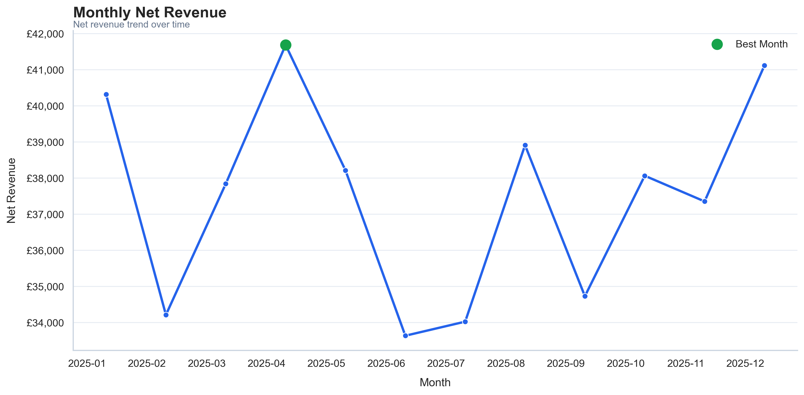
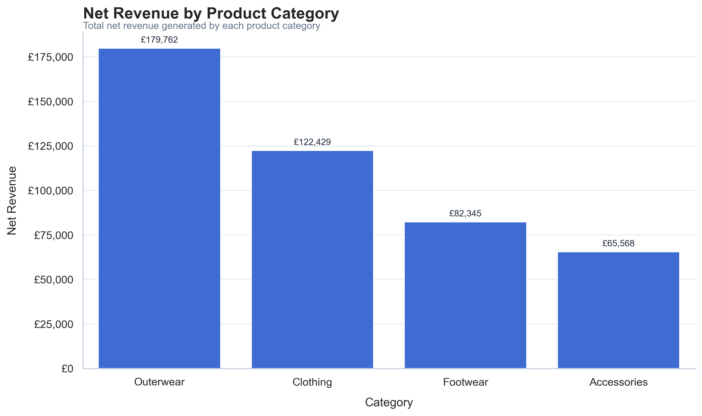
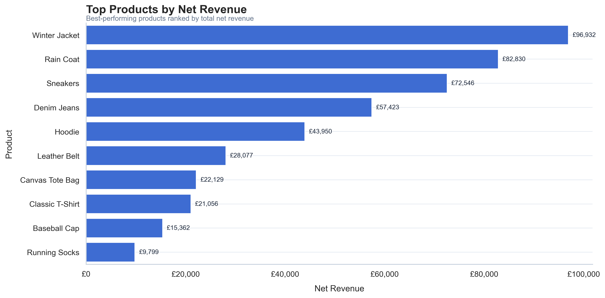
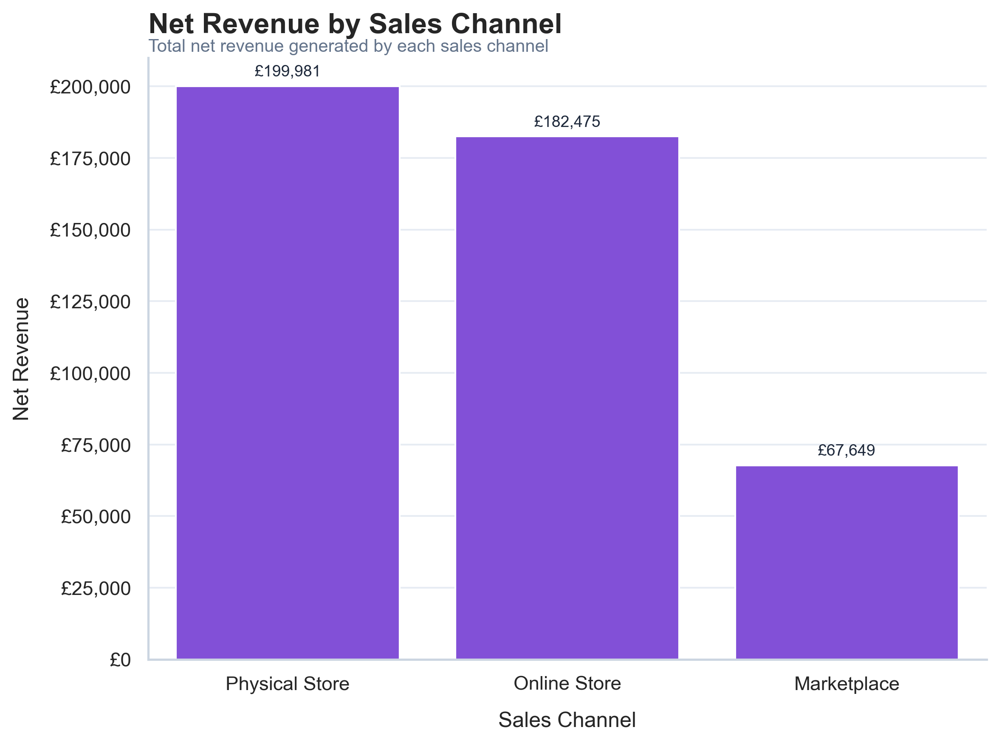
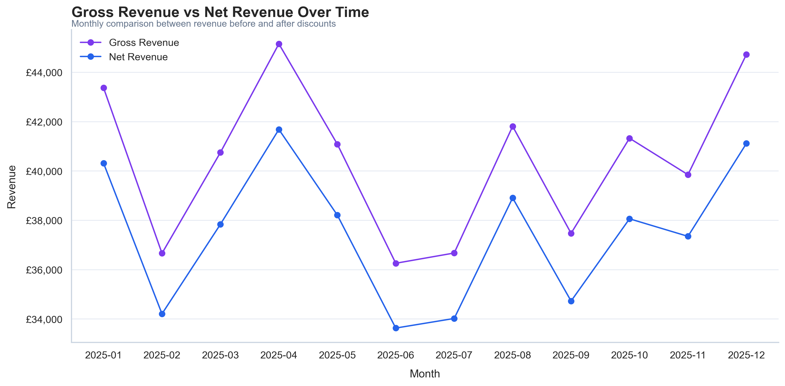
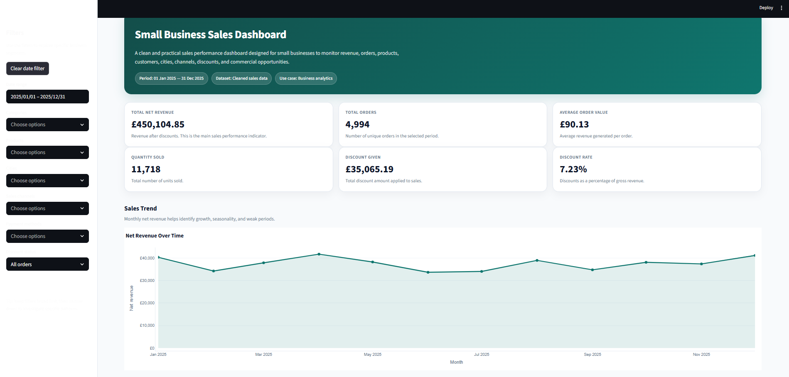

# Small Business Sales Data Cleaning & Analysis

## Overview

This project simulates a real-world data analysis task for a small retail business.

The goal was to clean, organise, analyse, and present sales data in a way that helps a business owner understand sales performance, product contribution, sales channels, discount behaviour, and business opportunities.

The project focuses on practical business value rather than unnecessary technical complexity.

## Business Context

Small businesses often collect sales data in spreadsheets, but the data is not always ready for analysis.

Common problems include:

- duplicated records;
- missing values;
- inconsistent product names;
- inconsistent category labels;
- invalid quantities;
- invalid discounts;
- mixed date formats;
- unclear revenue metrics.

This project uses a synthetic dataset created to simulate a realistic sales dataset from a small UK retail business.

## Business Questions

The analysis aimed to answer the following questions:

- How much net revenue did the business generate?
- How many orders and units were sold?
- What was the average order value?
- Which product categories generated the most revenue?
- Which products were the strongest revenue drivers?
- Which sales channels performed best?
- Which cities generated the most revenue?
- How did revenue change over time?
- How did discounts affect revenue?
- What practical recommendations can be made for the business?

## Dataset

The dataset was synthetically created.

It simulates sales transactions from a small retail business selling products across multiple channels:

- Physical Store
- Online Store
- Marketplace

The raw dataset intentionally included realistic data quality issues such as missing values, duplicated rows, inconsistent labels, invalid quantities, invalid discounts, and mixed date formats.

## Project Workflow

The project followed these steps:

1. Business problem definition
2. Synthetic dataset creation
3. Data quality assessment
4. Data cleaning and preparation
5. Exploratory data analysis
6. Key business metrics creation
7. Business insights and recommendations
8. Final visualisation selection
9. Final business report creation
10. GitHub and portfolio organisation

## Tools Used

- Python
- pandas
- NumPy
- matplotlib
- seaborn
- Jupyter Notebook
- Markdown

## Key Deliverables

- Cleaned sales dataset
- Data quality assessment
- Exploratory data analysis notebook
- Business KPIs
- Revenue and product performance charts
- Business insights and recommendations
- Final Markdown report

## Main Findings

The analysis identified several important business findings:

- Net revenue varied throughout the year, with a mid-year decline followed by a recovery in the final quarter.
- Outerwear was the strongest product category by net revenue.
- Accessories underperformed compared with other categories.
- Revenue was concentrated in a few key products, especially Winter Jacket, Rain Coat, and Sneakers.
- Products with high unit sales were not always the strongest revenue drivers.
- Physical Store and Online Store were the strongest sales channels.
- Marketplace underperformed compared with the owned channels.
- Revenue was relatively distributed across cities, but London underperformed compared with other major cities.
- Most revenue came from full-price sales.
- Higher discounts did not clearly improve revenue in this dataset.

## Business Recommendations

Based on the analysis, the business should:

- monitor net revenue, orders, average order value, units sold, and discounts monthly;
- investigate the causes of the mid-year revenue decline and final-quarter recovery;
- prioritise Outerwear in stock planning and product visibility;
- review Accessories to understand whether the issue is pricing, promotion, variety, or demand;
- protect key products such as Winter Jacket, Rain Coat, and Sneakers;
- compare product volume with revenue and profit margin before making product decisions;
- continue supporting Physical Store and Online Store;
- review whether Marketplace should be improved, repositioned, or kept as a secondary channel;
- investigate London underperformance;
- avoid increasing discounts without analysing margin and customer response.

## Example Visualisations

### Monthly Net Revenue



### Net Revenue by Category



### Top Products by Revenue



### Net Revenue by Sales Channel



### Gross Revenue vs Net Revenue



## How to Run This Project

1. Clone the repository:

```bash
git clone https://github.com/JoalysonLima/small-business-sales-analysis.git
```

2. Navigate to the project folder:

```bash
cd small-business-sales-analysis
```

3. Create a virtual environment:

```bash
python -m venv .venv
```

4. Activate the virtual environment.

On Windows:

```bash
.venv\Scripts\activate
```

On macOS/Linux:

```bash
source .venv/bin/activate
```

5. Install the required dependencies:

```bash
pip install -r requirements.txt
```

6. Open the Jupyter Notebook:

```bash
jupyter notebook notebooks/01_sales_cleaning_analysis.ipynb
```

## Final Report

[View Final Report](reports/final_report.md)

## Interactive Dashboard

This project also includes a simple Streamlit dashboard built from the cleaned sales dataset.

The dashboard helps small businesses monitor sales performance through:

- Total net revenue
- Total orders
- Average order value
- Quantity sold
- Discounts given
- Revenue trends over time
- Top products
- Best-performing categories
- Top customers
- Top cities
- Sales channels
- Payment methods
- Business insights and recommendations

### Dashboard Preview



### How to Run the Dashboard Locally

```bash
python -m streamlit run app/dashboard.py
```
### Live Dashboard

The interactive dashboard is available here:

[Open the Streamlit Dashboard](https://small-business-sales-analysis.streamlit.app/)

## Repository Structure

```text                                                                 
small-business-sales-analysis/
│
├── data/
│   ├── raw/
│   └── processed/
│
├── notebooks/
│   └── 01_sales_cleaning_analysis.ipynb
│
├── app/
│   ├── dashboard.py
│   └── utils.py
│
├── reports/
│   ├── figures/
│   ├── final_report.md
│   ├── business_insights.md
│   └── supporting CSV outputs
│
├── docs/
│   ├── dashboard_objective.md
│   └── dashboard_insights.md
│
├── README.md
├── requirements.txt
└── .gitignore