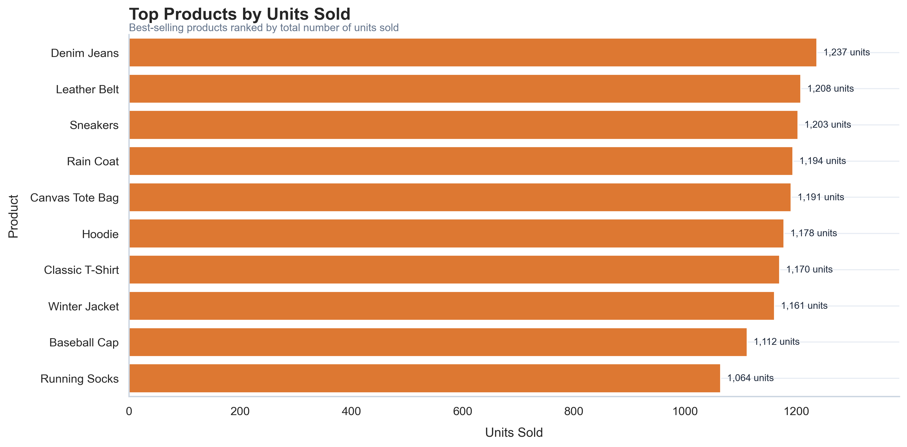
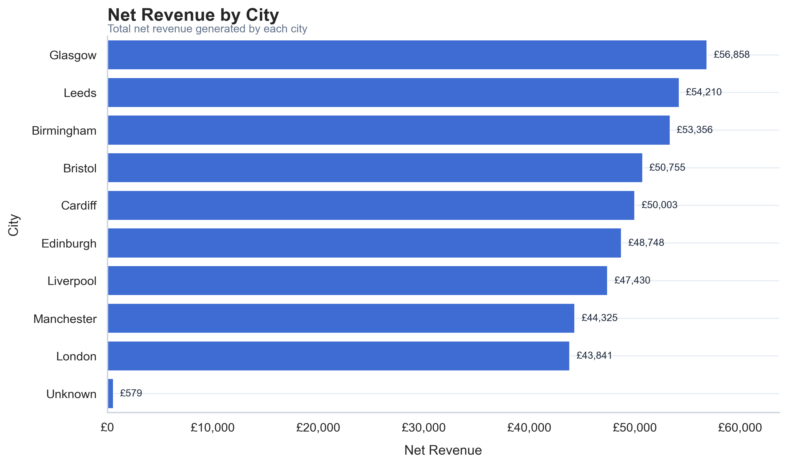
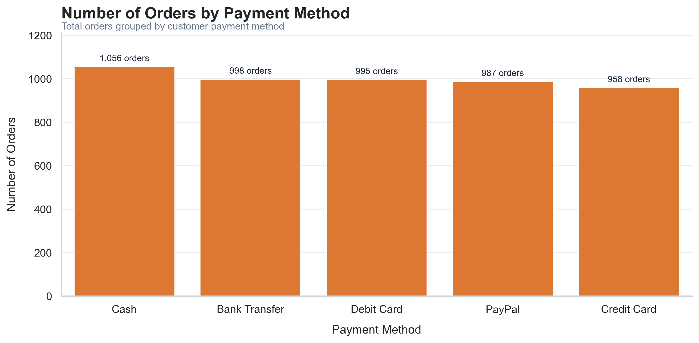
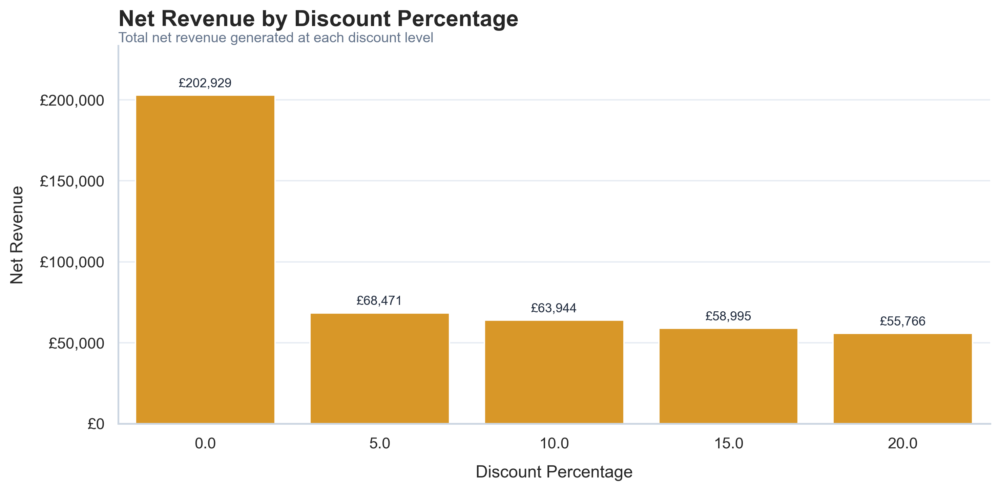

# Small Business Sales Data Cleaning & Analysis

## 1. Executive Summary

This project simulates a real-world freelance data analysis task for a small retail business.

The business had sales data with common quality issues, including duplicated records, missing values, inconsistent text formatting, invalid numerical values, and mixed date formats.

The goal of this project was to clean, organize, analyse, and transform the sales data into useful business insights.

### Key Results

| Metric | Value |
|---|---:|
| Total Net Revenue | £450,105 |
| Total Orders | 4,994 |
| Total Units Sold | 11,718 |
| Average Order Value | £90 |
| Total Discount | £35,065 |
| Overall Discount Rate | 7.23% |
| Best Month by Revenue | 2025-04 |
| Worst Month by Revenue | 2025-06 |
| Top Category | Outerwear |
| Top Category Revenue Share | 39.94% |
| Top Product | Winter Jacket |
| Top Product Revenue Share | 21.54% |
| Top Sales Channel | Physical Store |
| Top Sales Channel Revenue Share | 44.43% |
| Top City | Glasgow |
| Top City Revenue Share | 12.63% |
| Top 5 Products Revenue Share | 78.58% |

---

## 2. Business Context

Small businesses often collect sales data in spreadsheets, but the data may not be ready for analysis.

Common problems include duplicated rows, missing values, inconsistent product names, inconsistent category labels, invalid quantities, invalid discounts, and incorrect date formats.

This project uses a synthetic dataset created to simulate a realistic small business sales scenario. The dataset represents sales from a small retail business selling products through multiple channels, including physical store, online store, and marketplace.

---

## 3. Business Problem

The business needs to understand its sales performance and answer practical questions such as:

- How much revenue was generated?
- Which products and categories performed best?
- Which sales channels generated the most revenue?
- Which cities contributed the most sales?
- How did revenue change over time?
- How much did discounts affect revenue?
- Are there data quality issues that could affect decision-making?

---

## 4. Project Scope

### Included in Scope

- Data quality assessment
- Data cleaning and standardisation
- Missing value treatment
- Duplicate removal
- Date conversion
- Revenue metric creation
- Exploratory data analysis
- Business KPI calculation
- Business insights and recommendations
- Final Markdown report

### Outside the Scope

- Machine learning
- Sales forecasting
- Dashboard development
- Customer segmentation
- Profit margin analysis
- Inventory optimisation
- Marketing attribution

These items could be considered in future project versions.

---

## 5. Methodology

The project followed these steps:

1. Defined the business problem and analytical scope.
2. Created a realistic synthetic sales dataset.
3. Diagnosed data quality issues.
4. Cleaned and standardised the dataset.
5. Created revenue and time-based metrics.
6. Performed exploratory data analysis.
7. Created key business KPIs.
8. Generated business insights and recommendations.
9. Selected final visualisations for reporting.
10. Created this final Markdown report.

---

## 6. Data Cleaning Summary

The raw dataset contained several data quality issues that needed to be fixed before analysis.

The main cleaning steps included:

- removing exact duplicated rows;
- standardising column names;
- cleaning customer and city fields;
- standardising product names;
- standardising product categories;
- standardising sales channel labels;
- standardising payment method labels;
- converting dates to datetime format;
- removing invalid quantities;
- filling missing unit prices using the median price of the same product;
- replacing missing and invalid discounts with 0;
- creating gross revenue, discount amount, and net revenue columns;
- creating month, quarter, and year columns for time-based analysis.

### Cleaning Summary Table

| metric                 |   before_cleaning |   after_cleaning |
|:-----------------------|------------------:|-----------------:|
| Rows                   |              5012 |             4994 |
| Columns                |                12 |               20 |
| Duplicated rows        |                12 |                0 |
| Missing customer names |                 8 |                0 |
| Missing cities         |                 6 |                0 |
| Missing unit prices    |                 4 |                0 |
| Missing discounts      |                 5 |                0 |
| Invalid quantities     |                 6 |                0 |
| Invalid discounts      |                 6 |                0 |

---

## 7. Key Business Metrics

The main revenue metric used in this analysis is **net revenue**, because it represents sales after discounts.

The project also analysed total orders, total units sold, average order value, discount rate, product contribution, category contribution, channel performance, city performance, and monthly revenue performance.

### Executive Metrics

| metric                          | value          |
|:--------------------------------|:---------------|
| Total Net Revenue               | £450,105       |
| Total Orders                    | 4,994          |
| Total Units Sold                | 11,718         |
| Average Order Value             | £90            |
| Total Discount                  | £35,065        |
| Overall Discount Rate           | 7.23%          |
| Best Month by Revenue           | 2025-04        |
| Worst Month by Revenue          | 2025-06        |
| Top Category                    | Outerwear      |
| Top Category Revenue Share      | 39.94%         |
| Top Product                     | Winter Jacket  |
| Top Product Revenue Share       | 21.54%         |
| Top Sales Channel               | Physical Store |
| Top Sales Channel Revenue Share | 44.43%         |
| Top City                        | Glasgow        |
| Top City Revenue Share          | 12.63%         |
| Top 5 Products Revenue Share    | 78.58%         |

---

## 8. Final Visualisations and Chart-Level Analysis

The project selected the main charts created during the exploratory analysis to support the final business findings.

Each chart below answers a specific business question and includes a short interpretation based on the analysis performed in the notebook.

---

### 8.1 Monthly Net Revenue

**Business question:** How did net revenue evolve throughout the year?

Net revenue fluctuated throughout 2025, with a noticeable mid-year decline followed by a recovery in the final quarter. December ended as one of the strongest months of the year.

This suggests that the business should monitor monthly revenue regularly and investigate what may have caused weaker mid-year performance and stronger year-end recovery. Possible factors include seasonality, promotions, stock availability, customer demand, or sales channel performance.

---

### 8.2 Net Revenue by Product Category

**Business question:** Which product categories generated the most revenue?

Outerwear was the main revenue driver, while Accessories underperformed compared with the other categories.

This indicates that the business should protect and expand high-performing categories, especially Outerwear. At the same time, Accessories should be reviewed to understand whether the issue is related to pricing, promotion, product variety, product placement, or lower customer demand.

---

### 8.3 Top Products by Net Revenue

**Business question:** Which products generated the most revenue?

Revenue was heavily concentrated in a few key products, especially Winter Jacket, Rain Coat, and Sneakers.

These products are commercially important and should be prioritised in stock planning, pricing decisions, and promotional visibility. However, the business should also review lower-revenue products to decide whether they should be improved, bundled, discounted, repositioned, or removed from the product mix.

---

### 8.4 Top Products by Units Sold

**Business question:** Which products sold the most units?

Sales volume was broadly distributed across products, with no extreme concentration in units sold.

However, the comparison between units sold and revenue shows that high-volume products are not always the largest revenue drivers. This means that product price and profit margin should be analysed before making decisions based only on quantity sold.

A product can sell many units and still contribute less revenue than a higher-priced product with lower volume.

---

### 8.5 Net Revenue by Sales Channel

**Business question:** Which sales channels generated the most revenue?

Physical Store and Online Store were the main revenue drivers, while Marketplace significantly underperformed.

This suggests that the business should protect its owned channels and investigate the role of Marketplace. Marketplace may still be useful as a secondary channel, but the business should review whether it is worth additional investment or whether the focus should remain on Physical Store and Online Store.

---

### 8.6 Net Revenue by City

**Business question:** Which cities generated the most revenue?

Revenue was fairly well distributed across cities, with Glasgow, Leeds, and Birmingham leading.

London underperformed compared with other major cities. This may justify a closer review of the customer base, product mix, marketing reach, delivery coverage, or channel presence in that location.

The business should avoid assuming that larger cities automatically generate stronger sales without checking the data.

---

### 8.7 Orders by Payment Method

**Business question:** Which payment methods were most used by customers?

Orders were evenly distributed across payment methods, with Cash slightly leading.

There does not appear to be a clear payment bottleneck. However, Credit Card usage could be reviewed to check whether fees, checkout experience, or customer preference are affecting adoption.

The business should maintain multiple payment options because customer behaviour is not concentrated in a single method.

---

### 8.8 Net Revenue by Discount Percentage

**Business question:** How is revenue distributed across discount levels?

Most net revenue came from full-price sales. Discounted orders contributed less, and higher discounts did not clearly improve revenue.

This suggests that the business should review whether discounts are necessary, especially discounts above 5%. The analysis does not prove that discounts reduce or increase demand, but it shows that full-price sales are responsible for most revenue in this dataset.

Before increasing promotional activity, the business should compare discount levels with profit margin, average order value, and units sold.

---

### 8.9 Gross Revenue vs Net Revenue Over Time

**Business question:** How much did discounts affect monthly revenue?

Gross revenue and net revenue moved together throughout the year, with a clear mid-year decline and year-end recovery.

Discounts reduced monthly revenue, but they did not appear to fundamentally change the overall sales trend. This means the business should monitor discounts carefully, but the main sales pattern seems to be driven by broader revenue movements rather than discount behaviour alone.

---

### 8.10 Selected Figures Index

The table below summarises the selected figures and the business questions they support.

| figure_file                            | business_question                                    |
|:---------------------------------------|:-----------------------------------------------------|
| monthly_net_revenue.png                | How did net revenue evolve over time?                |
| net_revenue_by_category.png            | Which product categories generated the most revenue? |
| top_products_by_revenue.png            | Which products generated the most revenue?           |
| net_revenue_by_sales_channel.png       | Which sales channel performed best?                  |
| gross_vs_net_revenue_over_time.png     | How much did discounts affect revenue over time?     |
| net_revenue_by_city.png                | Which cities generated the most revenue?             |
| net_revenue_by_discount_percentage.png | How is revenue distributed across discount levels?   |

---

## 9. Business Insights

The visual analysis and business metrics show that revenue performance was not evenly distributed across time, products, categories, channels, and locations.

### 9.1 Revenue trend

Net revenue fluctuated throughout 2025. The business experienced a noticeable mid-year decline, followed by a recovery in the final quarter. This suggests that monthly revenue should be monitored regularly, and the business should investigate what drove both the weaker mid-year period and the stronger year-end performance.

### 9.2 Category performance

Outerwear was the strongest category by net revenue, making it a key revenue driver for the business. In contrast, Accessories underperformed compared with the other categories.

This indicates that the business should protect high-performing categories while reviewing whether weaker categories need better pricing, promotion, product variety, or placement.

### 9.3 Product performance

Revenue was heavily concentrated in a few products, especially Winter Jacket, Rain Coat, and Sneakers. These products are commercially important and should receive attention in stock planning, pricing, and promotion.

However, lower-revenue products should also be reviewed to decide whether they should be improved, bundled, discounted, repositioned, or removed from the product mix.

### 9.4 Units sold versus revenue

The products with the highest unit sales were not always the largest revenue drivers. This shows that sales volume alone is not enough to evaluate product performance.

Product price and margin should be analysed before making decisions based only on quantity sold.

### 9.5 Sales channel performance

Physical Store and Online Store were the main revenue drivers, while Marketplace significantly underperformed.

This suggests that the business should protect its owned channels and review whether Marketplace should be improved, repositioned, or kept as a secondary channel.

### 9.6 City performance

Revenue was fairly well distributed across cities, with Glasgow, Leeds, and Birmingham leading. London underperformed compared with other major cities.

This may justify a closer review of customer base, product mix, marketing reach, delivery coverage, or channel presence in London.

### 9.7 Payment methods

Orders were evenly distributed across payment methods, with Cash slightly leading. There does not appear to be a clear payment bottleneck.

However, Credit Card usage could be reviewed to check whether fees, checkout experience, or customer preference are affecting adoption.

### 9.8 Discount performance

Most net revenue came from full-price sales. Discounted orders contributed less, and higher discounts did not clearly improve revenue.

This suggests that the business should review whether discounts are necessary, especially discounts above 5%. The analysis does not prove that discounts reduce or increase demand, but it shows that full-price sales are responsible for most revenue in this dataset.

### 9.9 Gross versus net revenue

Gross revenue and net revenue moved together throughout the year. Discounts reduced monthly revenue, but they did not appear to fundamentally change the overall sales trend.

This means that the business should monitor discounts carefully, but broader revenue movements seem more important than discount behaviour alone.

---

## 10. Recommendations

Based on the analysis, the following actions are recommended:

### 10.1 Monitor monthly revenue performance

Create a simple monthly KPI dashboard to track:

- net revenue;
- gross revenue;
- total orders;
- average order value;
- total discounts;
- units sold.

The business should investigate the causes of the mid-year decline and the final-quarter recovery.

### 10.2 Protect and expand Outerwear

Outerwear should be prioritised in:

- stock planning;
- product visibility;
- seasonal campaigns;
- pricing reviews.

Because it is the leading category, stockouts or weak visibility in this category could directly affect revenue.

### 10.3 Review Accessories performance

Accessories underperformed compared with other categories. The business should review whether the issue is related to:

- low demand;
- weak product variety;
- poor placement;
- pricing;
- lack of promotion;
- low perceived value.

The business should not automatically remove the category, but it should investigate whether Accessories can be improved or repositioned.

### 10.4 Prioritise key products

Winter Jacket, Rain Coat, and Sneakers should be closely monitored because they are major revenue drivers.

The business should ensure these products have:

- consistent stock availability;
- strong visibility across channels;
- suitable pricing;
- careful promotion planning.

### 10.5 Analyse margin before making product decisions

Products with high sales volume are not always the highest revenue drivers. Before changing the product mix, the business should compare:

- units sold;
- net revenue;
- unit price;
- product cost;
- profit margin.

This would help avoid overvaluing high-volume but low-value products.

### 10.6 Protect Physical Store and Online Store

Physical Store and Online Store are the strongest channels. The business should continue supporting both and review what makes them perform better than Marketplace.

Possible areas to review include:

- customer experience;
- product availability;
- marketing exposure;
- delivery or fulfilment;
- transaction costs.

### 10.7 Review Marketplace strategy

Marketplace significantly underperformed. The business should decide whether Marketplace should be:

- improved through better listings and promotions;
- kept as a secondary channel;
- reduced if costs and effort outweigh returns.

### 10.8 Investigate London underperformance

London underperformed compared with other major cities. The business should review:

- customer reach;
- local marketing;
- delivery coverage;
- product fit;
- channel availability;
- pricing sensitivity.

The goal is to understand whether London is an underdeveloped opportunity or simply a weaker market for this business.

### 10.9 Keep multiple payment options

Payment methods are relatively balanced, so the business should maintain multiple payment options.

Credit Card usage should be reviewed, but there is no evidence that payment methods are currently blocking sales.

### 10.10 Be cautious with discounts

The business should not increase discounts automatically.

Most revenue came from full-price sales, and higher discounts did not clearly improve revenue. Before running stronger promotions, the business should analyse:

- profit margin;
- average order value;
- units sold;
- customer response;
- revenue before and after promotions.

Discounts above 5% should be reviewed carefully because they may reduce revenue without clear evidence of stronger demand.

---

## 11. Business Interpretation

The analysis shows that the business has clear revenue drivers, but also areas that require closer review.

Revenue performance varied throughout the year, with a mid-year decline followed by a recovery in the final quarter. This suggests that the business should not evaluate performance only by annual totals. Monthly monitoring is necessary to understand changes in demand, stock availability, promotions, and channel performance.

Outerwear is the strongest category and should be treated as a strategic revenue driver. At the same time, Accessories underperformed and should be reviewed before further investment. The business should understand whether this weaker performance is caused by product range, pricing, visibility, or customer demand.

At product level, revenue is concentrated in a small number of high-performing items, especially Winter Jacket, Rain Coat, and Sneakers. This is positive because these products generate strong revenue, but it also creates dependency risk. If one of these products faces stock issues or demand drops, total revenue could be affected.

The comparison between products by revenue and products by units sold shows that volume alone is not enough to evaluate performance. A product can sell many units and still contribute less revenue than a higher-priced product with fewer sales. The next analytical step should include product cost and profit margin.

Physical Store and Online Store are the main commercial channels, while Marketplace underperforms. The business should protect its strongest channels and review whether Marketplace deserves improvement, repositioning, or lower priority.

City-level revenue is relatively distributed, but London underperforms compared with other major cities. This does not automatically mean London is a bad market, but it does justify further investigation into marketing reach, customer base, delivery coverage, and product fit.

Payment methods are balanced, which suggests that there is no clear payment bottleneck. The business should maintain multiple payment options while reviewing Credit Card usage if needed.

Discount analysis should be interpreted carefully. Most revenue came from full-price sales, and higher discounts did not clearly improve revenue. Discounts reduced net revenue, but they did not appear to change the overall sales trend. Therefore, the business should avoid increasing discounts without analysing margin and customer response.

Overall, the business should focus on protecting its strongest revenue drivers, investigating underperforming areas, monitoring monthly performance, and improving decision-making with margin and inventory data in future analysis.

---

## 12. Limitations

This analysis has some limitations:

- The dataset is synthetic.
- The analysis focuses on revenue, not profit.
- Product cost and margin data were not included.
- Customer acquisition costs were not included.
- Inventory levels were not available.
- The discount analysis is descriptive and does not prove causality.
- The project does not include forecasting or machine learning.

These limitations are important because business recommendations should not go beyond the available evidence.

---

## 13. Conclusion

This project demonstrates how raw sales data can be cleaned, analysed, and transformed into practical business insights.

The final output includes a cleaned dataset, business KPIs, visualisations, insights, recommendations, and a client-facing report.
